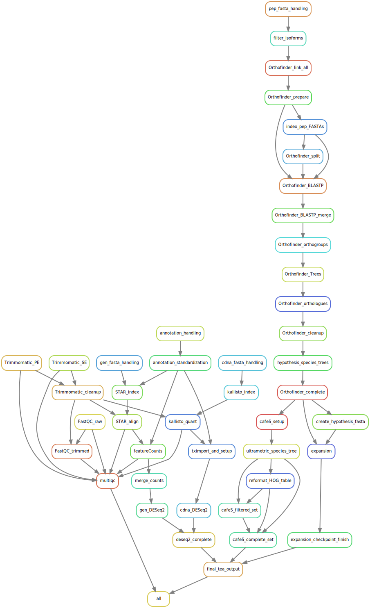

# A2TEA
Automated Assessment of Trait-associated Evolutionary Adaptations

This workflow combines RNA-seq analyses, differential gene expression, with evolutionary analyses - most notably gene family expansion events.
We use Orthofinder2 to infer gene duplication events and correlate these with significant physiological reaction patterns in the compared species.

At the moment for each species A2TEA requires as input RNA-Seq reads (both PE/SE possible) suitable for a differential expression experiments (control vs. treatment), either a genomic or transcriptomic fasta file + annotation (.gtf) as well as a peptide fasta.  


# Setup:
Install the Python 3 version of Miniconda.
you can get it here: https://docs.conda.io/en/latest/miniconda.html

Answer yes to the question whether conda shall be initialized and put into your PATH.

Then, you can install [mamba](https://github.com/QuantStack/mamba) (a faster replacement of conda in C++) with:

`conda install -c conda-forge mamba`

In it's current form, A2TEA requires at least snakemake v7.0.0 - install or upgrade with `mamba install -c conda-forge -c bioconda "snakemake>=7.0.0"`

Download/Clone the current release of the A2TEA workflow into the directory.

`git clone https://bitbucket.team.uni-bonn.de/scm/cbig/a2tea.git`

Setup the AHRD_Snakemake subworkflow by navigating into the cloned A2TEA directory and entering:

```
git submodule init
git submodule update
```


# Installation
## Option 1 (recommended):
Use installation of software during runtime by starting the workflow with the `--use-conda` option.
This will install seperate small conda environments for groups of or individual rules and is more stable.


## Option 2 (not recommended! & not yet updated):
The included workflow/envscomplete_environment.yaml file can be used to install all required software into an isolated Conda environment with a name of your choice - in the following we will call it "A2TEA":

`mamba env create --name A2TEA --file workflow/envscomplete_environment.yaml`

Activating the environment
To activate the snakemake-tutorial environment, execute

`conda activate A2TEA`

Now you can use the installed tools and our workflow without any software dependency issues.
For detailed options of snakemake see: https://snakemake.readthedocs.io/en/v5.5.1/executable.html

Should you want to remove the conda environment, execute
`conda env remove -n A2TEA`  

## Option 3 (not yet existing)
Singularity container


# General usage
## Recommended steps
1) Add or symlink all fastq files to the rawreads directory:  
  FASTQ files -> rawreads/  
  The config/samples.tsv that you need to adapt to your data/experiments expects the files to be located here.

2) Add or symlink all fasta & annotation files to a directory of your choosing - or jut take note where this data is located on your file system.
   The species.tsv file (explained in detail in 3.)) allows A2TEA to find these files.
   E.g. if you create a directory called 'FS/' in the main A2TEA directory and copy/symlink all fasta/annotation files there, then you have to refer to them as e.g. FS/fasta.fa in the species.tsv file.


3) Modify species.tsv, samples.tsv & hypotheses.tsv files  
species.tsv:  
- provide species name, species ploidy, a peptide fasta, an annotation file (.gff;.gff3;.gtf) as well as either a genomic or cDNA fasta (alignment or pseudoalignment), respectively
- files can be gzipped, or functioning URLs
- under 'function' choose for each species either "AHRD" or provide a tab seperated file with functional annotation information
	- a validity check of user supplied function annotation tables is performed
        - first line has to be the header - take note that when supplying AHRD output from a previous run etc. as a user supplied table you have to remove the first two lines (comment line and free line from the file)
	- we require a tab seperated table with at least one column "Protein-Accession" (= gene identifier) & another column "Gene-Ontology-Term"
	- column titled "Protein-Accession" should contain corresponding gene/transcript level identifiers 
	- multiple gene ontology terms per gene/transcript must be seperated by ", "
	- more work in progress here ... automatic parsing and functional enrichment in the future (will require check for gene/transcript identifiers as well...)
    
samples.tsv:  
- provide details for the fastq files you deposited/symlinked into rawreads/
- only when using cDNA FASTA and single-end reads for a species you NEED to add information to the fragment_length_mean column (single-end read length) as well as the standard deviation to the samples.tsv file
  
hypotheses.tsv (formulate hypotheses regarding your supplied data):  
(!NOTE: "min_expansion_factor" & "min_expansion_difference" are seperate criteria - if either one is passed the orthologous group will be used in downstream steps)  
- hypothesis - (integer) index number of hypothesis starting at 1
- name - (string) descriptive name (in quotations!); e.g. "Expanded in Arabidopsis compared to Monocots"
- expanded_in - (string) one or multiple species (seperated by ";") which are checked for gene family expansion events compared to one or multiple species (seperated by ";") under compared_to
- compared_to - (string) see above
- Nmin_expanded_in - (integer) minimum number of expanded_in species that need to fulfill expansion criteria for the gene family to be called expanded
- Nmin_compared_to - (integer) minimum number of compared_to species that need to fulfill expansion criteria (but in the opposite way aka contraction) for the gene family to be called expanded
- min_expansion_factor - (integer) minimum factor of expansion between expanded_in and compared_to species (!NOTE: set to unrealistically high integer - e.g. 100 - to use only "min_expansion_difference" criterium)
- min_expansion_difference - (integer) minimum # of additional genes expanded_in species possesses in contrast to compared_to species (per orthologous group) (!NOTE: set to unrealistically high integer - e.g. 100 - to use only "min_expansion_factor" criterium)
- expanded_in_all_found - (boolean) does every memeber of expanded_in species have to be present (not expanded!) in the orthologous_group
- compared_to_all_found - (boolean) does every memeber of compared_to species have to be present (not expanded!) in the orthologous_group
  
4) Using the activated environment perform a dry-run and check for problems with:    
`snakemake -np`  
   Ignore warning messages (pink) "The code used to generate one or several output files has changed: ...". 

5) Configure the config.yaml file to your needs  
- here you can adjust options for trimming, thread usage per rule and much more
- very important are the choices for automatic filtering for longest isoform of fasta files and whether gene or transcript level quantification/diff. exp. analysis should be performed (auto_isoform_filtering: "NO" & transcript_level_quantification: "YES")
	- very stable for standard fasta files from e.g. Ensembl, NCBI, etc.
	- when not set to "YES", we assume you performed appropiate (or no) filtering yourself
	- choosing automatic isoform filtering will create a subset peptide fasta file with only the longest isoform per gene; the header will be shortened to JUST the gene name identifier; this option MUST be used in conjunction with transcript_level_quantification: "NO"
	- if you perform the filtering yourself and want to perform gene level Diff. Exp. Analysis take care to have the fasta headers for a protein to be the simple gene identifier (no .1; .p3; etc.)
	- this is important since for the differential expression analysis we use tximport to reduce the cdna based quantification with tximport/kallisto to gene level (featureCounts if DNA fasta supplied), and association between orthology and expression analysis is the purpose of this software
	- IN ANY USE-CASE: THE NAMES BETWEEN PEP. FASTA AND EITHER GENES OR TRANSCRIPTS IN THE SPECIES SPECIFIC GTF HAS TO MATCH!!
	- some examples:
		- case 1. you have standard fasta and annotation files from ensembl/NCBI; want to have one rep. protein seq. per GENE and trust the automatic process -> auto_isoform_filtering: "YES" & transcript_level_quantification: "NO"
		- case 2. you filtered for longest isoform yourself (peptide fasta headers = gene names in respective gtf!) and are ok with the names being reduced to gene identifier -> auto_isoform_filtering: "NO" & transcript_level_quantification: "NO"
		- case 3. you don't want to our filter & either want to use the whole or a custom subset of the transcriptome -> auto_isoform_filtering: "NO" & transcript_level_quantification: "YES"; this is the hands-on case in which you the USER are mostly responsible; again, both featureCounts/tximport(kallisto) will produce count tables with the transcript names as found in the gtf; these transcript names have to match the headers in the peptide fasta files


6) Run A2TEA with (exchange XX for the amount of cores you can offer):  
`snakemake --cores XX --use-conda`  (remove `use-conda` if you installed all software into one conda environment - option 2)

# Important note on cDNA vs genomic fasta as choice for a species/ecotype/etc.:
cDNA input leads to kallisto as quantification software. This is much faster than using STAR and also requires much less resources.  
However, since our approach focuses on gene loci, the transcript-level quantification of kallisto needs to be aggregated to gene level as part of the differential expression analysis.  
This is done via the "makeTxDbFromGFF" function of the "GenomicFeatures" package in R (requires as input gff3 of gtf file).  
It works really well for the annotation files I have tested so far but this is i.m.O. a source of potential errors if e.g. non-standard annotations are used.  
In such cases, changes to the tximport.R script in scripts/ might be necessary - or one switches to the genomic FASTA/ STAR-based approach which directly quantifies at gene-level.  
For both tximport and (cDNA route) or featureCounts (gDNA route) we require an annotation file.
The workflow uses gffread to standardize any supplied gff, gff3, gtf annotation file to a common .gtf standard so that downstream steps work.  
  
  
# Some additional important pointers on usage:
1) Make sure that there are no ":" in your peptide fasta headers (e.g. custom headers) - this will lead to problems because orthofinder exchanges ":" for "_"  
2) As explained under General Usage 5) it is important that pep. fasta headers and either gene or transcript names as found in the annotation match. If you perform isoform filtering yourself, take note that transcripts not found in the pep. fasta won't be part of the downstream phylogenetic and combinatory analyses. These additional transcripts will however be quantified and their differential expression calculated. In the final diff. exp. output HOG_DE.a2tea they will appear but will be put into the singleton category. Depending on your downstream analyses you should consider removing such cases. An easy workaround is simply removing all secondary transcripts/isoforms from the annotation files as well before starting A2TEA.  
3) Species name between samples.tsv, species.tsv & hypotheses.tsv HAS to match up!  
4) Add the appropiate path "path/to/file" before the files in the species.tsv table  
5) Do NOT provide both a cDNA and genome fasta for a given species in the species.tsv file! However using cDNA fasta for one species and genome fasta for another is totally fine.  
6) URLs to the the fasta/annotation files are also supported.  
7) For reads, annotation and fastas both gzipped and uncompressed files are supported.
8) The amount of cores specified on the command-line sets the maximum that snakemake will be able to use. If rule threads set in the Snakefile exceed this limit, they will be automatically scaled down. This means that if you diverge from my standard (= 24 cores) A2TEA will still run, however by modifying the threads for individual rules (in config.yaml / the Snakefile itself) you can improve performance for your particular computational setup.  
9) With "auto_isoform_filtering" you can choose whether to try an automated approach for filtering the peptide fastas for their longest isoform or doing this yourself before starting the workflow. If the option is not set to "YES" the filtering is skipped.
10) With "add_blast_hits" you can define the max number of additional best blast hits to include in the follow-up analyses. Tree visualizations often are more informative if we use more than an individual (H)OG.  


# Common resons for errors: 
- falsely formatted annotations; e.g. gene_id field is called different in some lines geneID  
- format of fasta files -> same lengths of lines and shorter; otherwise samtools faidx etc. won't work  
  
# Output  
The final output is a single file - tea/A2TEA_finished.RData.  
This file can be used in R by using the load() command.  
Doing this, provides 3 seperate objects in your R environment containing all results in a compact form factor:  
- HYPOTHESES.a2tea - List object with one S4 object per hypothesis. 
Each S4 object contains several layers of nested information.   
E.g. `HYPOTHESES.a2tea$hypothesis_2@expanded_OGs$N0.HOG0001225` would refer to a specific expanded orthologous group and S4 data object that contains:
  - genes (orthologous group genes + extended BLAST hits)
  - genes_HOG (only genes in orthologous group - orthofinder analysis)
  - genes_extend_hits (only genes that are extended blast hits)
  - num_genes_complete (number of all genes - orthologous group + extended BLAST hits)
  - num_genes_HOG (# genes - only orthologous group)
  - num_genes_extend (number of extended BLAST hits)
  - fasta_files (peptide sequences for all genes - HOG + extended BLAST hits)
  - blast_table (complete blast results for HOG genes & extended BLAST hits)
  - msa (multiple sequence alignment - orthologous group + extended BLAST hits)
  - tree (phylogenetic tree - orthologous group + extended BLAST hits)
See the class definitions below for more details.  
- HOG_level_list - List object with one dataframe/tibble per hypothesis. Info includes Orthologous group, # genes per species, boolean expansion info, # of significant diff. exp. genes and more.
- HOG_DE.a2tea - Dataframe/Tibble with DESeq2 results for all genes + additional columns

You can use the the A2TEA_finished.RData output in your own R instance or use our WebApp (!name) which was specifically designed to allow for interactive inspection, visualization, filtering & export of the results and subsets.

```
#required packages for classes
library(readr)
library(Biostrings)
library(ape)

#using the following line fixes bug in which "phylo" is not found... need to investigate
setClass("phylo")

# define three classes
# class for the expanded_OG - containing all different types of data we have on it\n",
setClass("expanded_OG", slots=list(genes="spec_tbl_df",
                                   blast_table="tbl_df",
                                   nrow_table="numeric",
                                   num_genes_HOG="numeric",
                                   num_genes_extend="numeric",
                                   num_genes_complete="numeric",
                                   genes_HOG="tbl_df",
                                   genes_extend_hits="tbl_df",
                                   fasta_files="list", 
                                   msa="AAStringSet", 
                                   tree="phylo"))


# class for the hypotheses\n",
setClass("hypothesis", slots=list(description="character",
                                  number="character",
                                  expanded_in="character",
                                  compared_to="character",
                                  expanded_OGs="list",
                                  species_tree="phylo"))

# class for extended BLAST hits info\n",
setClass("extended_BLAST_hits", slots=list(blast_table="tbl_df",
                        num_genes_HOG="numeric",
                        num_genes_extend="numeric",
                        num_genes_complete="numeric",
                        genes_HOG="tbl_df",
                        genes_extend_hits="tbl_df"))
``` 

### The workflow in its current form:


