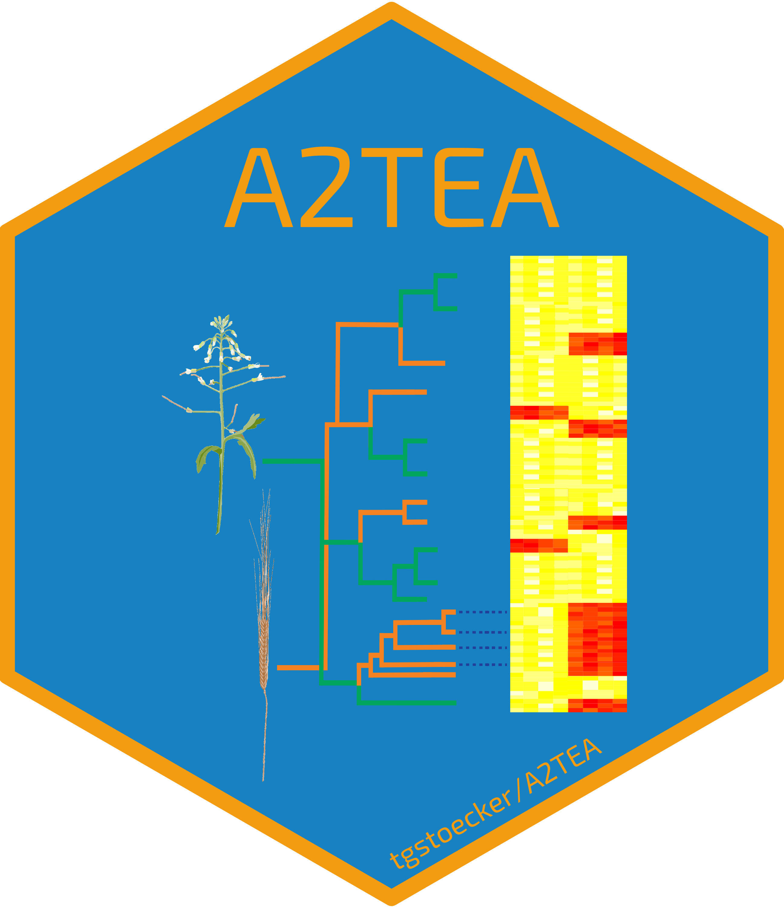

# A2TEA.Workflow

[](https://snakemake.readthedocs.io)
[](https://github.com/tgstoecker/A2TEA.WebApp/commits/master)
[](https://www.tidyverse.org/lifecycle/#stable)
[](https://zenodo.org/badge/latestdoi/526283448)

**A**utomated **A**ssessment of **T**rait-specific **E**volutionary **A**daptations

A2TEA is a tool facilitating exploration of genetic diversity and uncovering evolutionary adaptation to stresses by exploiting genome comparisons and existing RNA-Seq data. In order to identify candidate genes, gene family expansion events - as an important driver of adaptation - are integrated with differential gene expression to link genes to functions.

This workflow combines RNA-seq analyses (differential gene expression) with evolutionary analyses -> gene family expansion events.
We use Orthofinder2 to infer gene duplication events and integrate these with significant physiological reaction patterns in the compared species.

The newest releases of the workflow and WebApp now allow for final results without the need for transcriptomic data for *all* species during the workflow steps.  
Nevertheless, if possible the workflow should be run with input RNA-Seq reads (both PE/SE possible) suitable for a differential expression experiments (control vs. treatment), either a genomic or transcriptomic fasta file + annotation (.gtf) as well as a peptide fasta per species.  
This way, valuable phylogenetic information from species without available expression information for the conditions under investigation can be included.  
Functional information per species can be provided by the user or can be optionally inferred by our tool [AHRD](https://github.com/groupschoof/AHRD) during the workflow.  

You can use the the A2TEA_finished.RData output in your own R terminal/Rstudio or use our **[A2TEA.WebApp](https://github.com/tgstoecker/A2TEA.WebApp)** which was specifically designed to allow for interactive inspection, visualization, filtering & export of the results and subsets. We feature a tutorial for its usage and details on how to work with the results of a A2TEA.Workflow analysis run.

See the published paper!: [https://f1000research.com/articles/11-1137](https://f1000research.com/articles/11-1137)  
See the downstream R Shiny WebApp in action!: [https://tgstoecker.shinyapps.io/A2TEA-WebApp/](https://tgstoecker.shinyapps.io/A2TEA-WebApp/)  

# Setup:
Install the Python 3 version of Miniconda.
you can get it here: https://docs.conda.io/en/latest/miniconda.html

Answer yes to the question whether conda shall be initialized and put into your PATH.

Then, you can install [mamba](https://github.com/QuantStack/mamba) (a faster replacement of conda in C++) with:

`conda install -c conda-forge mamba`

In it's current form, A2TEA requires at least snakemake v7.12.1 - install or upgrade with `mamba install -c conda-forge -c bioconda "snakemake>=7.12.1"`.  
To circumvent dependency issues we also offer a containerized solution via a docker image hosted on dockerhub that can be used (details further below).  
Usage only requires Singularity to be installed, e.g.: `mamba  install -c conda-forge singularity`.  

Download/Clone the current release of the A2TEA workflow into the directory.

`git clone https://github.com/tgstoecker/A2TEA.Workflow.git`


### If you can't provide functional annotations for your genes/transcripts/proteins you will need to also do the following:
1. Open the Snakefile under `workflow/Snakefile` and uncomment the following lines:
```
configfile: "workflow/rules/AHRD_Snakemake/config/config.yaml"
#and
include: "rules/AHRD_Snakemake/workflow/rules/download.smk"
include: "rules/AHRD_Snakemake/workflow/rules/diamond.smk"
include: "rules/AHRD_Snakemake/workflow/rules/get_ahrd.smk"
include: "rules/AHRD_Snakemake/workflow/rules/extract_header_and_length.smk"
include: "rules/AHRD_Snakemake/workflow/rules/create_ahrd_input.smk"
include: "rules/AHRD_Snakemake/workflow/rules/run_ahrd.smk"
```
2. Setup the AHRD_Snakemake subworkflow by navigating into the cloned A2TEA.Workflow directory and entering:
```
git submodule init
git submodule update
```

3. In the `config/species.tsv` add `AHRD` in the column `function` for all species for which novel functional information needs to be generated.

Note again, that these steps are not necessary if you provide functional information on a per gene/transcript level for each species yourself.

# :arrow_double_down: Setup & Installation
## Option 1 (runtime installation - **faster & should be tried first**):
Use installation of software during runtime by starting the workflow with the `--use-conda` option.
This will install seperate small conda environments for groups of or individual rules. However, if requirements & dependencies change, some environments might fail to build.

## Option 2 (Docker container with Singularity - **guaranteed stability but slower**)
By using the latest version of our docker container image via the combination of the commands `--use-conda --use-singularity` we can circumvent most potential issues that can arise when using option 1.  
From the Snakemake docs:  
*"Snakemake will first pull the defined container image, and then create the requested conda environment from within the container. The conda environments will still be stored in your working environment, such that they don’t have to be recreated unless they have changed. The hash under which the environments are stored includes the used container image url, such that changes to the container image also lead to new environments to be created. When a job is executed, Snakemake will first enter the container and then activate the conda environment."*  
This is perfectly stable in most cases but slower.  
If during the checkpoint steps many hypotheses are analyzed and the user chose many additional closest orthologous groups be added for multiple sequence alignment, tree building, etc. it can be a good idea to stop the run (CTRL + C) and continue without the `--use-singularity` option.  This is due to the workflow re-evaluating the DAG at this point and scheduling a huge amount of novel jobs (several ten- to hundreds of thousands), for each of which the container environment will be entered and the appropiate environment loaded seperately.  
Note that you need to have singularity installed - e.g. `mamba  install -c conda-forge singularity`.  
  
Since on some systems or shared clusters the standard /tmp directory is quite small it can be necessary to change this to another directory.  
A easy solution is to reate a tmp directory inside the workflow directory and set the tmpdir singularity env variable to this.  
```
mkdir /scratch2/cropbio/stoecker/A2TEA-pipeline/master_dev/a2tea/tmp/
export SINGULARITY_TMPDIR=/scratch2/cropbio/stoecker/A2TEA-pipeline/master_dev/a2tea/tmp/
```
  
Snakemake scripts sometimes can't find input files when using singularity - this is probably because the correct directories haven't been bind-mounted when singularity was run.  
Adding this to the snakemake command usually helps:  
```
--singularity-args '-B /scratch2/cropbio/stoecker/A2TEA-pipeline/master_dev/a2tea'
#remember however that if you bind mount directories you have to make sure all input files can be found
#linking files from a mounted connection somewhere else on the file system
#therefore just copy every input file into the A2TEA.Workflow directory to be on the safe side
```
  
# :ballot_box_with_check: Test run & data
When cloning this repo the workflow is set up to run a three species analysis with *Hordeum vulgare*, *Zea mays* & *Oryza sativa japonica* and their reaction patterns to drought stress.  
Peptide fastas are reduced to 2000 proteins; sequencing reads are subsampled to 2M reads.  
The fasta/annotation files and sequencing reads are hosted - here.  
Fasta & annotation files are all either downloaded from ensemblPlants and still possess their original name or in the case of the functional annotations were computed using [AHRD](https://github.com/groupschoof/AHRD).  
NCBI SRA accession IDs of sequencing reads:
- Hordeum vulgare: SRR6782243, SRR6782247, SRR6782257, SRR6782249, SRR6782250, SRR6782254
- Zea mays: SRR2043219, SRR2043217, SRR2043190, SRR2043220, SRR2043226, SRR2043227
- Oryza sativa japonica: SRR5134063, SRR5134064, SRR5134065, SRR5134066

These correspond to the following studies relating to drought stress:  
- Hordeum vulgare: [https://doi.org/10.1186/s12864-019-5634-0](https://doi.org/10.1186/s12864-019-5634-0)  
- Zea mays: [https://doi.org/10.1104/pp.16.01045](https://doi.org/10.1104/pp.16.01045)  
- Oryza sativa japonica: [https://doi.org/10.3389/fpls.2017.00580](https://doi.org/10.3389/fpls.2017.00580)  

By running the the script `get_test_data.sh` all of these input files are automatically downloaded and put into the correct places.  
**We recommend performing this step, reading the next passage which lists several considerations regarding input data and then starting a trial run of the workflow.**  

# :control_knobs: General usage
## Recommended steps
1) Add or symlink all fastq files to the rawreads directory:  
  FASTQ files -> rawreads/  
  The config/samples.tsv that you need to adapt to your data/experiments expects the files to be located here.

2) Add or symlink all fasta & annotation files to a directory of your choosing - or just take note where this data is located on your file system.
   The species.tsv file (explained in detail in 3.)) allows A2TEA to find these files.
   E.g. if you create a directory called 'FS/' in the main A2TEA directory and copy/symlink all fasta/annotation files there, then you have to refer to them as e.g. FS/fasta.fa in the species.tsv file.


3) Modify species.tsv, samples.tsv & hypotheses.tsv files  
species.tsv:  
- provide species name, species ploidy, a peptide fasta, an annotation file (.gff;.gff3;.gtf) as well as either a genomic or cDNA fasta (alignment or pseudoalignment), respectively
- if you don't possess transcriptomic data for a species simply leave the genomic, cDNA fasta and annotation positions empty
- files can be gzipped, or functioning URLs
- under 'function' choose for each species either "AHRD" or provide a tab seperated file with functional annotation information
	- a validity check of user supplied function annotation tables is performed
        - first line has to be the header - take note that when supplying AHRD output from a previous run etc. as a user supplied table you have to remove the first two lines (comment line and free line from the file)
	- we require a tab seperated table with at least one column "Protein-Accession" (= gene identifier) & another column "Gene-Ontology-Term"
	- column titled "Protein-Accession" should contain corresponding gene/transcript level identifiers 
	- multiple gene ontology terms per gene/transcript must be seperated by ", "
	- more work in progress here ... automatic parsing and functional enrichment in the future (will require check for gene/transcript identifiers as well...)
    
samples.tsv:  
- provide details for the fastq files you deposited/symlinked into rawreads/
- only when using cDNA FASTA and single-end reads for a species you NEED to add information to the fragment_length_mean column (single-end read length) as well as the standard deviation to the samples.tsv file
  
hypotheses.tsv (formulate hypotheses regarding your supplied data):  
(!NOTE: "min_expansion_factor" & "min_expansion_difference" are seperate criteria - if either one is passed the orthologous group will be used in downstream steps)  
- hypothesis - (integer) index number of hypothesis starting at 1 (don't skip any integers!)
- name - (string) descriptive name (in quotations!); e.g. "Expanded in Arabidopsis compared to Monocots"
- expanded_in - (string) one or multiple species (seperated by ";") which are checked for gene family expansion events compared to one or multiple species (seperated by ";") under compared_to
- compared_to - (string) see above
- Nmin_expanded_in - (integer) minimum number of expanded_in species that need to fulfill expansion criteria for the gene family to be called expanded
- Nmin_compared_to - (integer) minimum number of compared_to species that need to fulfill expansion criteria (but in the opposite way aka contraction) for the gene family to be called expanded
- min_expansion_factor - (integer) minimum factor of expansion between expanded_in and compared_to species (!NOTE: set to unrealistically high integer - e.g. 100 - to use only "min_expansion_difference" criterium)
- min_expansion_difference - (integer) minimum # of additional genes expanded_in species possesses in contrast to compared_to species (per orthologous group) (!NOTE: set to unrealistically high integer - e.g. 100 - to use only "min_expansion_factor" criterium)
- Nmin_expanded_genes - (integer) minimum # of genes of expanded species required to consider the OG for expansion; this option can be left at 0 for most analyses (ratio/difference selection) but helps if the ratio/difference based methods lead to unexpected results in very small OGs in cases where ploidy normalization was performed
- expanded_in_all_found - (boolean) does every memeber of expanded_in species have to be present (not expanded!) in the orthologous_group
- compared_to_all_found - (boolean) does every memeber of compared_to species have to be present (not expanded!) in the orthologous_group
  
4) Using the activated environment perform a dry-run and check for problems with:    
`snakemake -np`  
   Ignore warning messages (pink) such as "The code used to generate one or several output files has changed: ...". 

5) Configure the config.yaml file to your needs  
- here you can adjust options for trimming, thread usage per rule and much more
- very important are the choices for automatic filtering for longest isoform of fasta files and whether gene or transcript level quantification/diff. exp. analysis should be performed (auto_isoform_filtering: "NO" & transcript_level_quantification: "YES")
	- very stable for standard fasta files from e.g. Ensembl, NCBI, etc.
	- when not set to "YES", we assume you performed appropiate (or no) filtering yourself
	- choosing automatic isoform filtering will create a subset peptide fasta file with only the longest isoform per gene; the header will be shortened to JUST the gene name identifier; this option MUST be used in conjunction with transcript_level_quantification: "NO"
	- if you perform the filtering yourself and want to perform gene level Diff. Exp. Analysis take care to have the fasta headers for a protein to be the simple gene identifier (no .1; .p3; etc.)
	- this is important since for the differential expression analysis we use tximport to reduce the cdna based quantification with tximport/kallisto to gene level (featureCounts if DNA fasta supplied), and association between orthology and expression analysis is the purpose of this software
	- IN ANY USE-CASE: THE NAMES BETWEEN PEP. FASTA AND EITHER GENES OR TRANSCRIPTS IN THE SPECIES SPECIFIC GTF HAS TO MATCH!!
	- some examples:
		- case 1. you have standard fasta and annotation files from ensembl/NCBI; want to have one rep. protein seq. per GENE and trust the automatic process -> auto_isoform_filtering: "YES" & transcript_level_quantification: "NO"
		- case 2. you filtered for longest isoform yourself (peptide fasta headers = gene names in respective gtf!) and are ok with the names being reduced to gene identifier -> auto_isoform_filtering: "NO" & transcript_level_quantification: "NO"
		- case 3. you don't want to our filter & either want to use the whole or a custom subset of the transcriptome -> auto_isoform_filtering: "NO" & transcript_level_quantification: "YES"; this is the hands-on case in which you the USER are mostly responsible; again, both featureCounts/tximport(kallisto) will produce count tables with the transcript names as found in the gtf; these transcript names have to match the headers in the peptide fasta files (e.g. removing additional info from common fasta headers "sed '/^>/ s/ .*//' file.fasta")


6) Run A2TEA with (exchange XX for the amount of cores you can offer):  
`snakemake --cores XX --use-conda`  (add `--use-singularity` if you want to use the singularity image - option 2)  
- Note that a dry-run can be performed which is likely to tell you of missing files etc. with `snakemake --cores XX --use-conda -np`.  
- When using the `--use-singularity` option, depending on your compute environment, it can be advantageous to explicitly define the `tmp/` and `cache/` locations. This is due to these locations often defaulting to shared /tmp/ locations that may be quite limited in terms of storage space or general user permissions. To circumvent this, we provide two directories `workflow/singularity_run/tmp/` and `workflow/singularity_run/cache/` which you can use as locations by explicitly defining/exporting the appropiate environment variables:
	```
	export SINGULARITY_TMPDIR=/full-path-to-A2TEA.Workflow/workflow/singularity_run/tmp/
	export SINGULARITY_CACHEDIR=/full-path-to-A2TEA.Workflow/workflow/singularity_run/cache/
	```
- Also when using the `--use-singularity` option, be aware to make sure that snakemake can find your input files. One can run into problems when not considering that e.g. some read or fasta files are only linked from a distant directory elsewhere on the filesystem.  
To circumvent this, you can make sure that directories are bind-mounted when singularity is run by addtionally specifying e.g.: `--singularity-args '-B /path/to/directory'`.
Generally speaking the safest way is always to have all input files as part of the A2TEA.Workflow directory itself.

## Important note on cDNA vs genomic fasta as choice for a species/ecotype/etc.:
cDNA input leads to kallisto as quantification software. This is much faster than using STAR and also requires much less resources.  
However, since our approach focuses on gene loci, the transcript-level quantification of kallisto needs to be aggregated to gene level as part of the differential expression analysis.  
This is done via the "makeTxDbFromGFF" function of the "GenomicFeatures" package in R (requires as input gff3 of gtf file).  
It works really well for the annotation files we have tested so far but this is a potential source of errors if e.g. non-standard annotations are used.  
In such cases, changes to the tximport.R script in scripts/ might be necessary - or one switches to the genomic FASTA/ STAR-based approach which directly quantifies at gene-level.  
For both tximport and (cDNA route) or featureCounts (gDNA route) require an annotation file.
The workflow uses gffread to standardize any supplied gff, gff3, gtf annotation file to a common .gtf standard so that downstream steps work.  
    
## Some additional important pointers on usage:
1) Make sure that there are no ":" in your peptide fasta headers (e.g. custom headers) - this will lead to problems because orthofinder exchanges ":" for "_"  
2) As explained under General Usage 5) it is important that pep. fasta headers and either gene or transcript names as found in the annotation match. If you perform isoform filtering yourself, take note that transcripts not found in the pep. fasta won't be part of the downstream phylogenetic and combinatory analyses. These additional transcripts will however be quantified and their differential expression calculated. In the final diff. exp. output HOG_DE.a2tea they will appear but will be put into the singleton category. Depending on your downstream analyses you should consider removing such cases. An easy workaround is simply removing all secondary transcripts/isoforms from the annotation files as well before starting A2TEA.  
3) Species name between samples.tsv, species.tsv & hypotheses.tsv HAS to match up!  
4) Add the appropiate path "path/to/file" before the files in the species.tsv table  
5) Do NOT provide both a cDNA and genome fasta for a given species in the species.tsv file! However using cDNA fasta for one species and genome fasta for another is totally fine.  
6) URLs to the the fasta/annotation files are also supported.  
7) For reads, annotation and fastas both gzipped and uncompressed files are supported.
8) The amount of cores specified on the command-line sets the maximum that snakemake will be able to use. If rule threads set in the Snakefile exceed this limit, they will be automatically scaled down. This means that if you diverge from my standard (= 24 cores) A2TEA will still run, however by modifying the threads for individual rules (in config.yaml / the Snakefile itself) you can improve performance for your particular computational setup.  
9) With "auto_isoform_filtering" you can choose whether to try an automated approach for filtering the peptide fastas for their longest isoform or doing this yourself before starting the workflow. If the option is not set to "YES" the filtering is skipped.
10) With "add_OGs:" in the config.yaml you can define the max number of closest orthologous groups to include in the follow-up analyses. The next based blast hit belonging to another OG will lead to include this OG in an addtional set; if set to e.g. 3 for each expanded OG we include the next three "closest" OGs
; if there aren't any usable blast hits less than 3 will be added. Tree visualizations often are more informative if we use more than an individual OG and allow to pinpoint mistakes in the tree generation or the MSA.  
11) Make sure that hypotheses in the hypotheses.tsv are numbered 1:N and you don't skip any number or start with anoher integer!  
12) It is possible for a hypothesis to NOT have any expanded OGs - in this case the workflow will provide you with a snakemake error message during the extraction of fasta sequences for expanded OGs: `missing input files for rule fasta_extraction ... wildcards: hypothesis={hypothesis}, OG=empty.txt, ...`. As the dummy file `empty.txt` was written under `tea/{hypothesis}/add_OGs_sets/id_lists/` no expanded OGs exist for the `{hypothesis}`based on the chosen parameters. The user can decide to either adapt parameters or remove the hypothesis from the experiment by deleting it from the config/hypotheses.tsv file. In the latter case, please make sure to adapt the associated hypothesis numbers in the file as well (see 11.)) to 1:N. After this continue/rerun the workflow with the additional flag `--rerun-incomplete`.  


## Common resons for errors: 
- falsely formatted annotations; e.g. gene_id field is called different in some lines geneID  
- format of fasta files -> same lengths of lines and shorter; otherwise samtools faidx etc. won't work  
  
# :beginner: Output  
The final output is a single file - tea/A2TEA_finished.RData.  
This file can be used in R by using the load() command.  
Doing this, provides several seperate objects in your R environment containing all results in a compact form factor:  
- HYPOTHESES.a2tea - List object with one S4 object per hypothesis. 
Each S4 object contains several layers of nested information.   
E.g. `HYPOTHESES.a2tea$hypothesis_2@expanded_OGs$N0.HOG0001225` would refer to a specific expanded orthologous group and S4 data object that contains:
  - blast_table (complete blast results for HOG genes & extended BLAST hits)
  - add_OG_analysis (includes msa, tree and gene info for expanded OG and additional OGs based on best BLAST hits)
See the class definitions below for more details.  
- HOG_level_list - List object with one dataframe/tibble per hypothesis. Info includes Orthologous group, # genes per species, boolean expansion info, # of significant diff. exp. genes and more. Last n list element is a non-redundant superset of all species analyzed over all formulated hypothesis. This makes it easy to create a comparison set e.g. conserved OGs of all species to which the hypothesis then can be compared.  
- HOG_DE.a2tea - Dataframe/Tibble with DESeq2 results for all genes + additional columns  
- A2TEA.fa.seqs - Non-redundant list object containg corresponding AA fasta sequences of all genes/transcripts in the final analysis. (includes those of exp. OGs + those in additonal BLAST hits & additional OGs based on user chosen parameters).
- SFA/SFA_OG_level - gene/transcript level tables that contains functional predicitons (human readable & GO terms) - see AHRD info
- hypotheses - a copy of the user defined hypotheses definitions for the underlying workflow run
- all_speciesTree - phylogenetic tree of all species in the workflow run (non-redundant superset of hypotheses) as inferred Orthofinder/STAG/Stride

You can use the the A2TEA_finished.RData output in your own R terminal/Rstudio or use our **[A2TEA.WebApp](https://github.com/tgstoecker/A2TEA.WebApp)** which was specifically designed to allow for interactive inspection, visualization, filtering & export of the results and subsets. We feature a tutorial for its usage and details on how to work with the results of a A2TEA.Workflow analysis run.

For R console work with obtained results the bare requirement is to run the following code chunk defining the classes.

```
#required packages for classes
library(readr)
library(Biostrings)
library(treeio)


# define necessary classes
# class for the expanded_OG - containing all different types of data we have on it
setClass("expanded_OG", slots=list(blast_table="tbl_df",
                                   add_OG_analysis="list"))

# class for the hypothese
setClass("hypothesis", slots=list(description="character", 
                                  number="character",
                                  expanded_in ="character", 
                                  compared_to="character", 
                                  expanded_OGs="list",
                                  species_tree="phylo"))

#class for adding OGs analysis
setClass("add_OG_set",
         slots=list(genes="spec_tbl_df",
                    msa="AAStringSet", 
                    tree="phylo"
                   )
         )
``` 

# :framed_picture: The workflow visualized:  
Note that checkpoint rules (spawned due to DAG re-evaluation - e.g. unknown number of output files at the beginning of the workflow) are not included in this tree diagram. Between the "expansion" checkpoint and "expansion_checkpoint_finish" aggregation rule many jobs are spawned as here for each set of additionally considered orthologous groups of and incl. the expanded orthologous group (and per hypothesis) sequence extraction, multiple sequence alignments & phylogenetic tree building are performed.  


