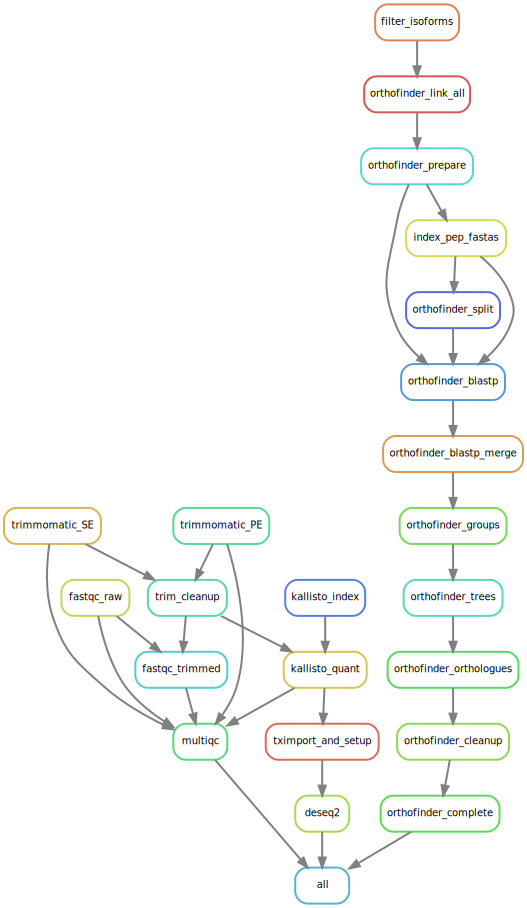

# A2TEA
Automated Assessment of Trait specific Evolutionary Adaptations

This workflow combines RNA-seq analyses, differential gene expression, with evolutionary analyses - most notably gene family expansion events.
We use Orthofinder2 to infer gene duplication events and correlate these with significant physiological reaction patterns in the compared species.

((Transcriptome assemblies -> AHRD annotation also possible...))

# Current 08.06.2020:
Installation of necessary software currently not implemented.  
Idea is to offer two solutions - the first as decribed in the next paragraph using a conda environment and a second in which all software will be installed at runtime.  
Also some cleanup is necessary, namely removal of redundancy or deletion of aspects which are unused ideas, e.g. the layout of the species table still includes a genome fasta.  

# Setup:
Install the Python 3 version of Miniconda.
you can get it here: https://docs.conda.io/en/latest/miniconda.html

Answer yes to the question whether conda shall be put into your PATH.
For detailed options concerning conda/bioconda see:

Then, you can install Snakemake with

`conda install -c bioconda -c conda-forge snakemake=5.9.1`

Preparing a working directory
First, create a new directory and change into that directory in your terminal.

Download/Clone the current release of the A2TEA workflow into the directory.

The included environment.yaml file can be used to install all required software into an isolated Conda environment with a name of your choice - in the following we will call it "A2TEA":

`conda env create --name A2TEA --file environment.yaml`

Activating the environment
To activate the snakemake-tutorial environment, execute

`conda activate A2TEA`

Now you can use the installed tools and our workflow without any software dependency issues.
For detailed options of snakemake see: https://snakemake.readthedocs.io/en/v5.5.1/executable.html

Should you want to remove the conda environment, execute
`conda env remove -n A2TEA`

### The workflow in its current form:

